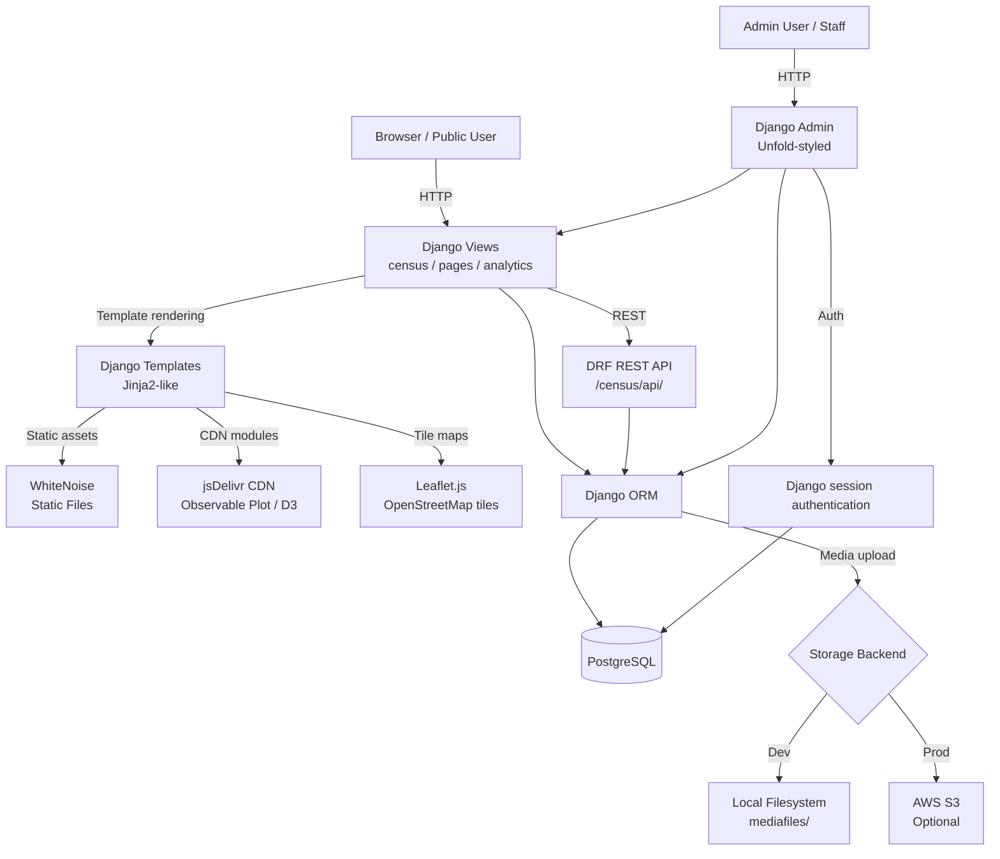
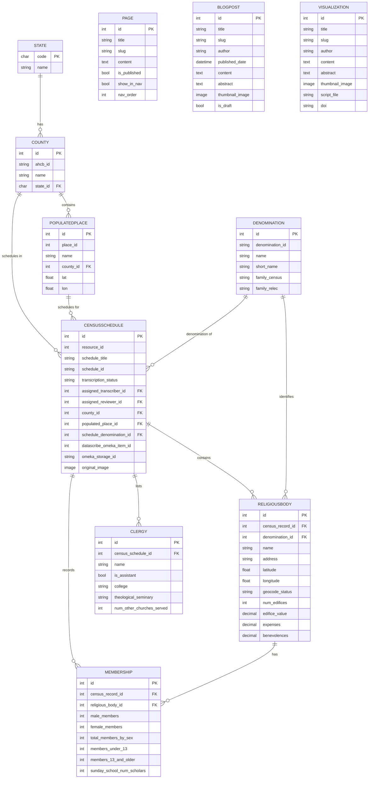

# AGENTS.md

> For feature specifications, business rules, and domain models, see [SPEC.md](./SPEC.md).

---

## Table of Contents

- [Project Overview](#project-overview)
- [Tech Stack](#tech-stack)
  - [Package Management](#package-management)
  - [Backend](#backend)
  - [Frontend](#frontend)
  - [Database](#database)
- [Project Initialization](#project-initialization)
- [Project Structure](#project-structure)
- [Architecture](#architecture)
  - [System Architecture Diagram](#system-architecture-diagram)
  - [Database Schema Diagram](#database-schema-diagram)
  - [REST API Design](#rest-api-design)
- [Authentication & Authorization](#authentication--authorization)
  - [User Auth](#user-auth)
  - [API Auth](#api-auth)
- [Development Workflow](#development-workflow)
  - [Version Control](#version-control)
  - [Database Migrations](#database-migrations)
  - [Debugging & Logging](#debugging--logging)
  - [Serving the Application](#serving-the-application)
  - [Testing Approach](#testing-approach)
- [Best Practices & Key Conventions](#best-practices--key-conventions)
- [Notes for AI Agents](#notes-for-ai-agents)

---

## Project Overview

**Religious Ecologies** is a Django-based platform for transcribing, managing, and visualizing historical American religious census data. The project serves historians and researchers at Roy Rosenzweig Center for History and New Media (RRCHNM) at George Mason University.

Core goals:
- Enable undergraduate/graduate students to transcribe handwritten 1926 Federal Census of Religious Bodies schedules
- Provide a structured workflow (assignment → transcription → review → approval) for team-based data entry
- Expose cleaned, structured data via a REST API and interactive public-facing visualizations
- Support scholarly publication through blog posts, interactive maps, and Observable Plot visualizations

Key users:
- **Transcribers** (student workers): Assigned census records to transcribe
- **Reviewers** (PIs, postdocs, staff): Oversee assignments, review transcriptions, approve records
- **Public**: Browse and explore data via interactive maps, charts, and blog posts

---

## Tech Stack

Python 3.12+ Django application with PostgreSQL, served via Daphne ASGI server. Admin interface customized with Django Unfold. Public frontend uses Foundation CSS, Leaflet.js maps, and Observable Plot for interactive visualizations.

### Package Management

- **Package manager**: `uv` (primary) and `poetry` both work; lock file is `uv.lock`
- **Python version**: ≥3.12
- **Key commands**:
  - `uv run python manage.py <cmd>` or `poetry run python manage.py <cmd>`
  - `make <target>` — Makefile provides ~40 convenience commands
- Lock file is committed; resolve conflicts by re-running `uv lock`

### Backend

- **Runtime**: Python 3.12+
- **Framework**: Django 6.0.5 (async via Daphne 4.1.2+)
- **Key libraries**:
  - `djangorestframework` — REST API
  - `django-filter` — Queryset filtering
  - `django-unfold` — Admin UI customization
  - `django-simple-history` — Model change tracking (all major models have `HistoricalRecords`)
  - `django-import-export` — CSV/Excel import/export in admin
  - `django-tables2` — Table rendering
  - `django-cors-headers` — CORS support
  - `whitenoise` — Static file serving
  - `django-storages` + `boto3` — Optional S3 media storage
  - `easy-thumbnails` — Automatic image thumbnail generation
  - `python-dotenv` + `django-environ` — Environment variable management
  - `markdown` — Markdown rendering for blog/page content
  - `openpyxl` — Excel file support
- **API pattern**: RESTful via Django REST Framework

### Frontend

- **CSS framework**: Foundation (via `foundation.js`, `what-input.js`)
- **Tailwind CSS**: Available via `django-tailwind` with `theme` app; used in some views
- **Maps**: Leaflet.js for interactive choropleth and marker maps
- **Visualizations**: Observable Plot 0.6 + D3 v7 loaded from jsDelivr CDN via ES6 import maps (no bundler required)
- **Admin**: Django Unfold with custom Religious Ecologies blue theme (`#0060b1`)
- **No JavaScript framework** — vanilla JS with Django template rendering

### Database

- **Database**: PostgreSQL
- **ORM**: Django ORM (no separate query builder)
- **Migrations**: Django's built-in migration system
- **Full-text search**: Not configured; filter-based search via `django-filter`
- **Caching**: Memcached (production via `MEMCACHED_URL` env var); falls back to `LocMemCache` in local dev
- **Media storage**: Local filesystem (development), optional S3 (production via `OBJ_STORAGE` env var)
- **Thumbnails**: `easy-thumbnails` generates 4 sizes: admin (100×75), small (200×150), medium (400×300), large (800×600)

---

## Project Initialization

### Prerequisites
- Python ≥3.12
- PostgreSQL
- `uv` or `poetry`
- Node.js (for Tailwind CSS compilation, if needed)

### Setup

```bash
# 1. Clone repository
git clone <repo-url>
cd relec-django

# 2. Install dependencies
uv sync
# or: poetry install

# 3. Environment configuration
cp .env.example .env  # Edit with your values
```

Required environment variables (`.env`):
```
DB_HOST=localhost
DB_PORT=5432
DB_NAME=religious_ecologies
DB_USER=religious_ecologies
DB_PASS=yourpassword
SECRET_KEY=your-django-secret-key
DEBUG=True
ALLOWED_HOSTS=localhost,127.0.0.1
```

Optional environment variables:
```
OBJ_STORAGE=s3              # Enable S3 media storage
AWS_ACCESS_KEY_ID=...
AWS_SECRET_ACCESS_KEY=...
AWS_STORAGE_BUCKET_NAME=...
```

```bash
# 4. Create database
createdb religious_ecologies

# 5. Run migrations
uv run python manage.py migrate

# 6. Set up user groups and permissions
uv run python manage.py setup_transcription_groups

# 7. Create admin user
uv run python manage.py createsuperuser

# 8. (Optional) Import reference data
make import-locations     # Populated places from CSV
make import-denoms        # Denomination list from CSV

# 9. Start dev server
uv run python manage.py runserver
# or: make preview
```

Access at `http://localhost:8000`. Admin at `http://localhost:8000/admin/`.

### Common Setup Issues
- **`SynchronousOnlyOperation`**: The debug toolbar's template panel is disabled under Daphne/ASGI because it can evaluate querysets synchronously
- **Missing static files**: Run `uv run python manage.py collectstatic`
- **Thumbnail errors**: Ensure `mediafiles/` directory exists and is writable

---

## Project Structure

```
relec-django/
├── config/                    # Django project configuration
│   ├── settings.py            # Main settings (Unfold config, DB, auth, storage)
│   ├── urls.py                # Root URL routing
│   ├── asgi.py                # ASGI application (Daphne)
│   └── wsgi.py                # WSGI application (fallback)
│
├── census/                    # Core transcription app
│   ├── models.py              # Denomination, CensusSchedule, ReligiousBody, Membership, Clergy
│   ├── admin.py               # Enhanced admin: bulk actions, workflow filters, quality tools
│   ├── views.py               # Census browser, map views, denomination/location browsing
│   ├── api_views.py           # DRF viewsets for REST API
│   ├── api_root.py            # Custom API documentation root
│   ├── urls.py                # Census URL patterns
│   └── management/commands/   # Data import: datascribe, omeka, denominations, export
│
├── location/                  # Geographic hierarchy app
│   ├── models.py              # State, County, PopulatedPlace (+ deprecated Location)
│   ├── admin.py               # Location admin views
│   └── management/commands/   # import_locations, link_counties_from_omeka
│
├── pages/                     # CMS app
│   ├── models.py              # Page, BlogPost, Visualization
│   ├── views.py               # Page/blog/viz detail views
│   ├── urls.py                # Pages URL patterns
│   ├── context_processors.py  # Navigation context (nav pages)
│   └── management/commands/   # Hugo content migration tools
│
├── analytics/                 # Reporting & analysis app
│   ├── views.py               # Dashboard, query builder, analysis views
│   └── urls.py                # Analytics URL patterns
│
├── religious_ecologies/       # Core project app
│   ├── admin.py               # Custom dashboard context injection
│   └── apps.py                # AppConfig (loads admin dashboard)
│
├── templates/                 # All HTML templates
│   ├── base.html              # Site-wide base template
│   ├── index.html             # Home page
│   ├── admin/                 # Custom admin templates (dashboard, bulk assign, analysis)
│   ├── census/                # Census browser, detail, map, browse templates
│   ├── pages/                 # Blog, visualization, static page templates
│   └── analytics/             # Analytics dashboard template
│
├── static/                    # Source static files
│   ├── css/                   # custom_unfold.css, leaflet.css
│   ├── js/                    # app.js, foundation.js, what-input.js
│   ├── images/                # Logos (logo.svg, partner logos, NEH seal)
│   ├── viz/                   # Observable Plot wrapper scripts
│   └── data/                  # Data files for visualizations
│
├── staticfiles/               # Collected static (production; git-ignored)
├── mediafiles/                # Uploaded/fetched media (git-ignored)
│
├── theme/                     # Tailwind CSS theme app
│   └── static_src/            # Tailwind source (node_modules here)
│
├── static-data/               # CSV source data for imports
│   ├── denominations.csv
│   ├── popplaces_1926.csv
│   └── schedules_with_datascribe.csv
│
├── docs/                      # Additional documentation
│   └── INTERACTIVE_VISUALIZATIONS.md
│
├── Makefile                   # Development convenience commands (~40 targets)
├── pyproject.toml             # Project dependencies (uv/poetry)
├── uv.lock                    # Locked dependencies
├── Dockerfile                 # Container build
├── docker-compose.yml         # Local container composition
├── manage.py                  # Django entry point
├── CLAUDE.md                  # AI agent session notes
├── DEVNOTES.md                # Developer workflow documentation
└── README.md                  # Quick start guide
```

---

## Architecture

### System Architecture Diagram



### Database Schema Diagram



**App summaries:**

- **`location`**: Geographic reference data. `State → County → PopulatedPlace` is the single source of truth for all location data. The legacy `Location` model is deprecated and should not be used in new code.
- **`census`**: The core data app. `CensusSchedule` is the top-level transcription unit (one schedule image = one record). Each schedule has one or more `ReligiousBody` entities, each with `Membership` statistics and associated `Clergy`.
- **`pages`**: CMS content. `Page` for static site pages, `BlogPost` for scholarly blog posts, `Visualization` for featured interactive visualizations.

### REST API Design

Base URL: `/census/api/`

All endpoints are publicly readable (no auth required). Pagination is 100 items/page.

```
GET /census/api/
    → API root with links to all endpoints

GET /census/api/religious-bodies/
GET /census/api/religious-bodies/<id>/
    → ReligiousBody list/detail
    → Filters: denomination, county, populated_place, geocode_status
    → Search: name, denomination name
    → Order: name, denomination

GET /census/api/denominations/
GET /census/api/denominations/<id>/
    → Denomination list/detail
    → Search: name, short_name, family_census, family_relec
```

**Response format (list):**
```json
{
  "count": 1234,
  "next": "http://.../?page=2",
  "previous": null,
  "results": [ ... ]
}
```

**Common query parameters:**
- `?page=N` — pagination
- `?search=term` — full-text search
- `?ordering=field` — sort by field (prefix `-` for descending)

---

## Authentication & Authorization

### User Auth

- **Strategy**: Django session-based authentication
- **Providers**: Username/password via Django auth
- **Admin login**: `/admin/login/` (redirects to `/admin/`)
- **Sessions**: Database-backed (default Django session engine)
- **Password hashing**: Django default (PBKDF2)

**User Groups** (set up via `setup_transcription_groups` command):

| Group | Description |
|-------|-------------|
| Transcribers | Student workers; can add/edit; see only assigned records |
| Reviewers | PIs/staff; full add/edit/delete; see all records |
| Superusers | Full Django admin access |

**Transcription workflow permissions:**
- Transcribers: `census.add_censusschedule`, `census.change_censusschedule`, add/change on related models
- Reviewers: Full CRUD on all census models

### API Auth

- **Authentication**: None required — API is publicly readable
- **Write access**: Not exposed via API; all data modification is through Django admin
- **CORS**: Configured via `django-cors-headers` (check `CORS_ALLOWED_ORIGINS` in settings)
- **Rate limiting**: Not configured
- **Security headers**: Django's default security middleware (`SecurityMiddleware`)

---

## Development Workflow

### Version Control

- **Branching model**: Feature branches off `main`
- **Branch naming**:
  - `feat/description` — new features
  - `fix/description` — bug fixes
  - `refactor/description` — code cleanup
- **Commit format**: Conventional Commits (`feat:`, `fix:`, `refactor:`, `docs:`, `chore:`)
- **Main branch**: `main` — protected; deploy target

### Database Migrations

- **Tool**: Django's built-in migration system
- **Create migration**: `uv run python manage.py makemigrations <app>`
- **Apply migrations**: `uv run python manage.py migrate`
- **Makefile shortcuts**: `make mm` (makemigrations), `make migrate`

Best practices:
- Never edit a migration that has been applied to production
- Data migrations go in separate migration files from schema migrations
- Test migrations both forward and in reverse before committing
- The `location` app had a significant refactor (migration 0016 removed `ReligiousBody.location` FK) — do not reintroduce the old `Location` FK pattern

### Debugging & Logging

- **django-debug-toolbar**: Enabled when `DEBUG=True`; the template panel is disabled for ASGI compatibility.
- **Django shell**: `uv run python manage.py shell` or `make shell`
- **Logging**: Django's default logging to console; check `LOGGING` in `settings.py`
- **Log levels**: `DEBUG` in development, `INFO`/`WARNING` in production

### Serving the Application

**Development:**
```bash
uv run python manage.py runserver
# or
make preview
```
- Runs at `http://localhost:8000`
- Uses Daphne ASGI server via `manage.py runserver`

**Static files in development:**
- Served by Django's `runserver` from `STATICFILES_DIRS`
- After changes to Tailwind, run: `uv run python manage.py tailwind build`

**Production:**
```bash
uv run python manage.py collectstatic
# Deploy via Daphne or gunicorn with a reverse proxy (nginx)
```
- Static files served by WhiteNoise
- Media files: local filesystem or S3 (set `OBJ_STORAGE=s3`)
- Configure `ALLOWED_HOSTS`, `DEBUG=False`, and a strong `SECRET_KEY`

**Docker:**
```bash
docker-compose up
```

### Testing Approach

- **Framework**: `pytest-django` with `factory-boy` for test data
- **Run tests**: `uv run python -m pytest` or `uv run python -m pytest -v`
- **Test location**: `tests/` directory with factories in `tests/factories.py` and shared fixtures in `tests/conftest.py`
- **Coverage**: No minimum enforced; always write tests for new features
- **Patterns**: Use `pytest.mark.django_db` decorator; test both positive and negative scenarios
- **Fixtures**: `sample_dataset` creates a multi-state, multi-denomination dataset; `_clear_cache` autouse fixture prevents cross-test cache pollution

---

## Best Practices & Key Conventions

**Code Style:**
- Follow PEP 8; formatter: `black` (line length 88)
- Use double quotes for Python strings
- Sort imports with `isort`
- Use f-strings for string formatting
- Pre-commit hooks configured (`pre-commit`)
- HTML formatter: `djhtml`

**Django Conventions:**
- Follow Django's "batteries included" philosophy — use built-in features before third-party packages
- Use Django's ORM effectively; avoid raw SQL unless absolutely necessary
- Use Django signals sparingly and document them well
- Use `get_object_or_404` instead of manual exception handling
- Implement proper pagination for list views
- Use descriptive URL names for reverse URL lookups; always end URL patterns with a trailing slash
- Use template inheritance with base templates; avoid complex logic in templates
- Implement CSRF protection in all forms
- Use environment variables in a single `settings.py`; never commit secrets

**Naming Conventions:**
- Python: PEP 8 (snake_case variables/functions, PascalCase classes)
- Templates: kebab-case filenames
- URL names: `app_name:view_name` pattern (e.g., `census:browser`)
- Migration files: Auto-generated by Django (do not rename)

**Model Conventions:**
- Add `__str__` methods to all models for a better admin interface
- Use `related_name` for foreign keys when needed
- Define `Meta` class with appropriate options (ordering, verbose_name, etc.)
- Use `blank=True` for optional form fields, `null=True` for optional database fields
- All models include `created_at` / `updated_at` timestamps
- All major models use `django-simple-history` (`HistoricalRecords`) for change tracking
- Use `PROTECT` on foreign keys to prevent accidental cascades (except `CASCADE` on child records that must be deleted with parent)

**Location Hierarchy (Critical):**
- **Always** use `State → County → PopulatedPlace` — never reference the deprecated `Location` model
- Access location via `census_record.county.state` and `census_record.populated_place`
- Key `select_related` pattern:
  ```python
  ReligiousBody.objects.select_related(
      "census_record__populated_place__county__state",
      "census_record__county__state",
      "denomination",
  )
  ```

**API Patterns:**
- DRF ViewSets for standard CRUD; custom views for complex queries
- Always use `select_related` / `prefetch_related` on querysets to avoid N+1 queries
- Filter via `django-filter` FilterSets, not manual query parameter parsing

**Admin Patterns:**
- Custom admin views extend `AdminSite.admin_view()` for permission checks
- Bulk actions defined as methods on `ModelAdmin` with `short_description`
- Smart queryset filtering: override `get_queryset()` to scope by user group

**Visualizations:**
- Observable Plot visualizations use wrapper scripts (hardcoded div IDs, no params system)
- Import maps in `blog_detail.html` resolve `@observablehq/plot` and `d3` from CDN
- Each visualization is a standalone ES6 module — no global state

---

## Notes for AI Agents

**Preferred Patterns:**
- Use `uv run python manage.py` (or `make` targets) for all management commands
- Prefer `select_related` / `prefetch_related` over multiple queries
- Follow the existing `ModelAdmin` patterns in `census/admin.py` for new admin views
- Use Django's `messages` framework for user feedback in admin views

**Critical Context:**
- `ReligiousBody.location` FK **does not exist** — it was removed in migration 0016. Never add it back.
- The debug toolbar template panel is disabled intentionally for ASGI compatibility
- The `Location` model in `location/models.py` is deprecated — use `State`, `County`, `PopulatedPlace`
- Observable Plot visualizations use wrapper scripts with hardcoded div IDs; do not reintroduce the `@params` import system

**Ongoing Migrations/Debt:**
- The `analytics` app has views but no models — planned future expansion
- Some blog posts still reference legacy `featured_image` CharField; prefer `thumbnail_image` ImageField
- The Tailwind CSS integration (`theme` app) is available but not used consistently across all templates

**When Making Changes:**
- Run `uv run python manage.py check` after changes to catch configuration errors
- Run `uv run pytest` to verify nothing is broken
- After model changes, always run `makemigrations` and `migrate`
- Update `select_related` chains when adding new FK relationships to models used in list views

**What to Avoid:**
- Do not use synchronous ORM operations in async views (use `sync_to_async` or `aaync` ORM methods)
- Do not add `ReligiousBody.location` or any reference to the deprecated flat `Location` model
- Do not re-enable the debug toolbar template panel without verifying ASGI compatibility
- Do not create new standalone JavaScript frameworks/bundlers — the project intentionally avoids bundlers
- Do not add rate limiting without first checking if it affects the public-read API requirements
- Do not bypass `robots.txt` AI crawler blocks — they are intentional to prevent ASGI timeouts from aggressive crawlers

**File Modification Guidelines:**
- `census/models.py`: Contains the main workflow state machine; update `TRANSCRIPTION_STATUS_CHOICES` and `save()` auto-transition logic together
- `config/settings.py`: UNFOLD config is large; keep sidebar navigation groups organized by the existing 6 sections
- `templates/admin/index.html`: Custom dashboard; metrics are injected via `religious_ecologies/admin.py`
- Location filters in admin use `census_record__populated_place` and `census_record__county` paths — maintain this pattern

**Common Pitfalls:**
- Forgetting `select_related` on `census_record__populated_place__county__state` causes many N+1 queries in list views
- The `census_record` FK on `ReligiousBody` is `CASCADE`; deleting a `CensusSchedule` deletes all its `ReligiousBody`, `Membership`, and `Clergy` records
- `PopulatedPlace.place_id` is nullable (not all places have Apiary IDs); use `pk` for URL routing and internal references

---

*Last Updated: 2026-07-09*
*This document is maintained for AI agent context and onboarding.*
